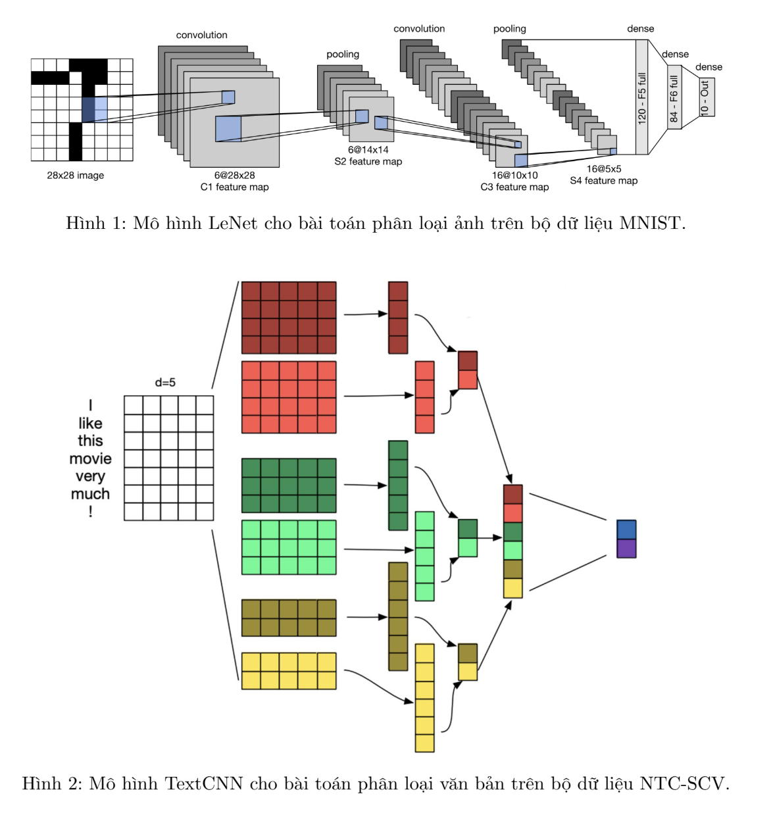
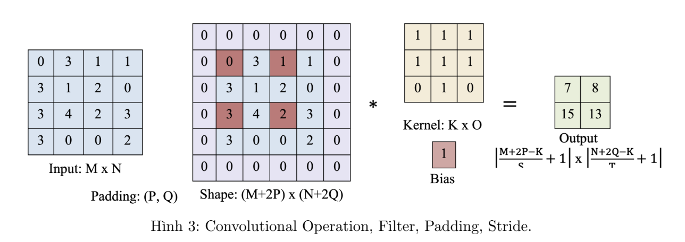
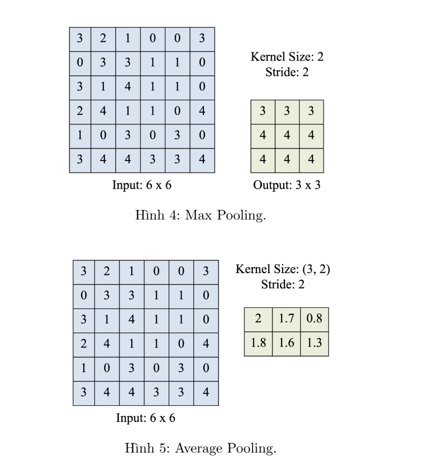
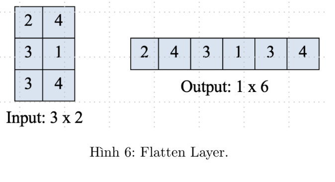

# CNN_Applications

Trong xử lý ảnh, mỗi ảnh có hàng ngàn pixels, mỗi pixel được xem như 1 feature, vậy nếu như một
bức ảnh có kích thước 1000 * 1000, thì sẽ có 1.000.000 features. Với normal feed-forward neural net-
works, mỗi layer là full-connected với previous input layer. Trong normal feed-forward neural network,
với mỗi layer, có 1.000.000 pixels, mỗi pixel lại kết nối full-connected với 1.000.000 pixels ở layer trước,
tức sẽ có 10^12 tham số. Đây là còn số quá lớn để có thể tính được vào thời điểm đó, bởi vì với mô hình
có nhiều tham số, sẽ dễ bị overfitted và cần lượng lớn data cho việc training, ngoài ra còn cần nhiều
memory và năng lực tính toán cho việc training và prediction.

Vì vậy, sự ra đời CNN giúp xây dựng các model giải quyết hiệu quả với dữ liệu ảnh. Có 2 đặc tính
của image hình thành nên cách hoạt động của CNN trên image, đó là feature localization và feature
independence of location.

Feature localization: mỗi pixel hoặc feature có liên quan với các pixel quanh nó.

Feature Independence of location: mỗi feature dù nó có nằm ở đâu trong bức ảnh, thì nó vẫn mang
giá trị của feature đó. CNN xử lý vấn đề có quá nhiều tham số với Shared parameters (feature inde-
pendence of location) của Locally connected networks (feature loclization), được gọi là Convolution Net.

Locally connected layer: Trong hidden layer đầu tiên, mỗi node sẽ kết nối tới một cụm nhỏ pixels
của input image chứ không phải toàn bộ image, gọi là small portion. Theo cách này, ta sẽ có ít kết nối
hơn, vì thế ít tham số hơn giữa input và hidden layer đầu tiên.

Shared parameters: Có nhưng khu vực, mà việc tìm ra feature là giống nhau về cách làm, vì vậy ta
có thể dùng chung bộ parameter, trong hình trên là phía phải bên trên và phía trái bên dưới. Tức ta
chia sẻ bộ parameter giữa những vị trí khác nhau trong bức ảnh.

CNN có 3 thành phần chính:

- Convulution layer: gồm Filter, Padding và Stride. Filter là locally connected network, mỗi filter
(kernel) sẽ học được nhiều feature trong images. Ma trận ảnh đầu vào có thể sẽ được padding thêm các
giá trị padding index vào ngoài các hàng và các cột. Mỗi filter sẽ di chuyển quanh bức ảnh với bước
nhảy được cấu hình trước là Stride.

- Pooling layer: bao gồm max-pooling và average-pooling layer tương ứng. Max-pooling layer chọn
giá trị lớn nhất từ cửa sổ tính toán, còn Average-pooling layer sẽ tính giá trị trung bình của các giá trị
mỗi kernel.

- Fully-connected layer: flatten convolution layer cuối cùng duỗi các ma trận nhiều chiều trong ảnh
và fully connect neuron cho output layer.

